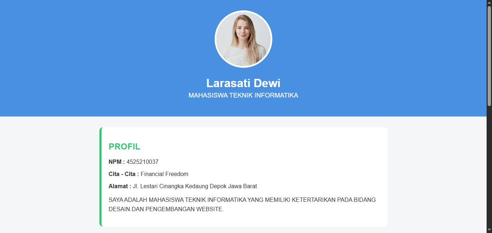
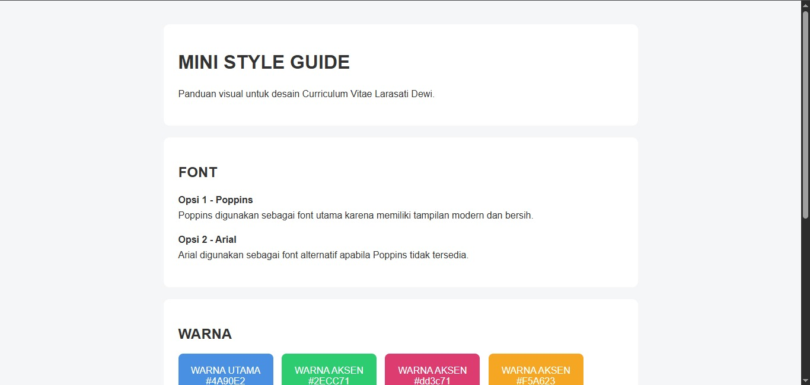

# Curriculum Vitae & Mini Style Guide

Project ini dibuat untuk tugas Praktikum Desain Web Pertemuan 3.
Project terdiri dari halaman Curriculum Vitae dan Mini Style Guide.

## 1. Curriculum Vitae

CV berisi informasi:
- Profil
- Pendidikan
- Keahlian
- Kontak

Desain menggunakan tampilan modern dengan warna biru sebagai warna utama
dan hijau sebagai warna aksen.

### Hasil Screenshot



---

## 2. Mini Style Guide

Mini Style Guide digunakan sebagai panduan visual untuk desain CV.

### Style Guide

- **Font utama:** Poppins
- **Font alternatif:** Arial
- **Warna utama:** `#4A90E2`
- **Warna aksen:** `#2ECC71`
- **Heading 1:** 32px
- **Heading 2:** 24px
- **Body text:** 16px
- **Line height:** 1.6

### Hasil Screenshot



---

## Struktur File

```text
Tugas Pertemuan 3/
│
├── css/
│   └── style.css
│
├── images/
│   └── foto_profil.jpg
│
├── TugasPertemuan3_1.html
├── TugasPertemuan3_2.html
└── README.md